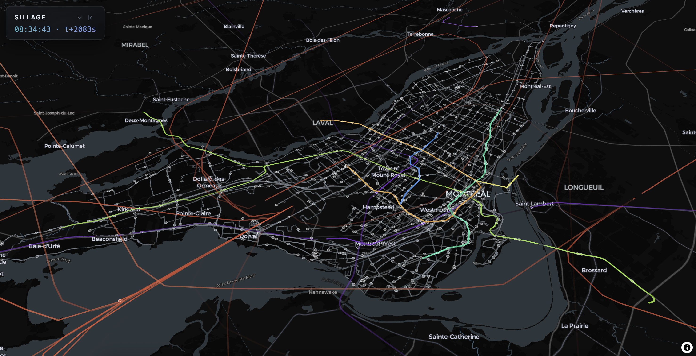

# Sillage

**Montréal's transit network, drawn as the trails its vehicles leave behind.**

[](https://kyuchia.github.io/sillage/)

<sub>Greater Montréal during the morning peak, 08:00–09:00, with buses, métro, REM, commuter trains, and aircraft replayed as animated trails. Colour identifies the mode; brighter trails indicate higher speeds.</sub>

Named after *sillage*, the French word for the wake a boat leaves on water, Sillage records live positions from STM buses and OpenSky aircraft in a PostGIS spatiotemporal database, simulates métro, commuter rail, and REM movement from static GTFS schedules, and replays them together as animated trails using deck.gl and MapLibre.

The [published demo](https://kyuchia.github.io/sillage/) uses curated, precomputed scenes and requires no backend. Run the project locally to query arbitrary time windows directly from the database.

---

## What it does

Two Python fetchers poll public APIs and write each position fix to PostgreSQL. A FastAPI backend retrieves a requested time window, combines the recorded positions with schedule-simulated modes on a shared timeline, and returns the paths and timestamps expected by deck.gl's `TripsLayer`.

The browser then replays that window interactively: scrub through time, change playback speed, adjust trail persistence, and toggle individual modes.

Because positions are stored rather than only streamed, any collected period can be replayed later.

---

## Stack

| Layer      | Choice                                                            |
| ---------- | ----------------------------------------------------------------- |
| Ingestion  | Python, `gtfs-realtime-bindings`, `opensky-api`                   |
| Storage    | PostgreSQL 17, PostGIS 3.6                                        |
| API        | FastAPI, uvicorn                                                  |
| Simulation | Static GTFS interpolation using `shapes.txt` and `stop_times.txt` |
| Map        | MapLibre GL JS                                                    |
| Layers     | deck.gl `TripsLayer` and `ScatterplotLayer`                       |
| Basemap    | CARTO Dark Matter                                                 |

---

## Setup

### Prerequisites

- PostgreSQL 17 with PostGIS (`brew install postgresql@17 postgis`)
- Python 3.12
- An STM API key from the [STM developer portal](https://portail.developpeurs.stm.info/apihub)
- An OpenSky OAuth2 client. Anonymous OpenSky access is capped at 400 requests per day, which is insufficient for sustained 20-second polling.

### Install

```bash
git clone https://github.com/kyuchia/sillage.git
cd sillage

python3 -m venv venv
source venv/bin/activate
pip install -r requirements.txt

createdb sillage
psql sillage < db/schema.sql
```

### Credentials

Secrets are stored in the macOS Keychain rather than in files or launchd property lists:

```bash
security add-generic-password -a "$USER" -s sillage-stm -T /usr/bin/security -U -w
./scripts/store_opensky_credentials.sh ~/Downloads/credentials.json
```

### Collect data

```bash
python fetchers/stm_fetcher.py       # buses, every 20s
python fetchers/opensky_fetcher.py   # aircraft, every 20s
```

An hour of morning rush-hour collection typically yields around 1,200 vehicles and 180,000 position fixes.

For unattended collection, launchd agents can run the fetchers independently of a terminal session and keep the machine awake for the lifetime of each process:

```bash
sudo pmset -c sleep 0 disksleep 0    # AC only; battery behaviour is unchanged
cp launchd/ca.sillage.*.plist ~/Library/LaunchAgents/
launchctl bootstrap gui/$UID ~/Library/LaunchAgents/ca.sillage.stm.plist
launchctl bootstrap gui/$UID ~/Library/LaunchAgents/ca.sillage.opensky.plist
```

### What was recorded

Recording is closed. Both launchd agents were booted out on 2026-09-18, and the archive stands at 25,520,876 positions:

| Table                 | Rows       | First fix (EDT)  | Last fix (EDT)   |
| --------------------- | ---------- | ---------------- | ---------------- |
| `vehicle_positions`   | 23,681,278 | 2026-04-14 22:28 | 2026-08-31 18:18 |
| `aircraft_positions`  |  1,839,598 | 2026-04-14 23:15 | 2026-09-18 04:04 |

Both tables cover one night in April and then a continuous run from 2026-08-18: buses to 08-31, aircraft to 09-18. The 125 days between April and August are a real gap, not lost data — the project was dormant and nothing was collected.

Bus collection ended when the machine left Montréal. `api.stm.info` times out from where it now lives, and the STM fetcher recorded 68,140 consecutive failed polls over 15.8 days before it was stopped. Aircraft collection continued, because OpenSky is reachable from anywhere.

The aircraft data has a gap of roughly two hours most evenings, around 18:00–20:00 EDT. That is the OpenSky daily credit quota running out and resetting at midnight UTC — expected behaviour, not a failure.

The exact environment the recording ran under is frozen in `requirements-snapshot.txt`. Recording can be restarted from Montréal by rebuilding the virtualenv from that file and loading the archived plists in `launchd/` back into `~/Library/LaunchAgents`, as above.

### Static GTFS

Fetch and archive the feeds used by the simulated modes:

```bash
python scripts/fetch_gtfs.py
```

### Visualize

```bash
uvicorn api.main:app --reload --port 8000
```

Open **[http://localhost:8000/](http://localhost:8000/)**. FastAPI serves the visualization directly.

URL parameters are forwarded to the API:

```text
/?layer=all&start=2026-08-20%2008:00-04:00&end=2026-08-20%2009:00-04:00
```

`layer` accepts `bus`, `aircraft`, `metro`, `train`, `rem`, the aliases `both` and `all`, or a comma-separated list such as `metro,rem`.

---

## The published demo

GitHub Pages serves `docs/` statically, so the published site cannot query the PostgreSQL database or FastAPI backend directly. Instead, selected time windows are exported into `docs/scenes/` and made available through a scene picker.

To rebuild them:

```bash
uvicorn api.main:app --port 8000 &
./scripts/bake_scenes.sh
```

When running locally, the visualization prefers the live API and falls back to the baked scenes if it is unavailable, and says so when it does. On the published demo there is no API to prefer, so the scenes are the content rather than a fallback.

---

## Data model

Recorded positions are stored in two tables. Each includes a `GENERATED` PostGIS geography column derived from latitude and longitude, a GiST index for spatial queries, and a B-tree index on `fetched_at` for time-range scans.

See [`db/schema.sql`](db/schema.sql) for the full schema.

For example, buses within 500 metres of Place-des-Arts during the morning peak of 2026-08-20 can be grouped by route with:

```sql
SELECT route_id, COUNT(DISTINCT vehicle_id)
FROM vehicle_positions
WHERE fetched_at >= '2026-08-20 08:00-04:00'
  AND fetched_at <  '2026-08-20 09:00-04:00'
  AND ST_DWithin(
        geom,
        ST_MakePoint(-73.5772, 45.5048)::geography,
        500
      )
GROUP BY route_id
ORDER BY 2 DESC;
```

---

## Rendering

`TripsLayer` represents each vehicle as one record containing parallel `path` and `timestamps` arrays. Sillage uses timestamps in seconds relative to the beginning of the requested window rather than Unix epoch values, avoiding unnecessary precision loss during deck.gl interpolation.

`TripsLayer` renders the trail but not a moving vehicle head. To show current positions, the client binary-searches each vehicle's timestamp array, finds the two fixes surrounding the current playback time, and interpolates between their coordinates. The resulting positions are rendered separately with `ScatterplotLayer`.

### Colour

**Hue identifies mode; brightness encodes speed.** Per-route colouring quickly becomes rainbow soup across more than 200 bus routes, so colour is assigned by mode instead. Official colours are preserved where available, including STM's four métro lines and REM's `#73A400`.

`scripts/check_colours.js` validates the resulting ramps with CIEDE2000 and fails the build when colours become too perceptually similar.

---

## Schedule simulation

STM does not publish `shape_dist_traveled`, so stops must be projected onto route geometry. A simple nearest-point search can place a later stop earlier along a shape where the route passes near itself, so projections are constrained to move forward.

GTFS times can also extend past midnight. A departure at `25:30:00`, for example, belongs to the previous service day even though it occurs on the next calendar day.

Finally, static GTFS feeds cover limited service periods. Historical recordings are therefore matched to a compatible service date when the original date falls outside the available feed.

---

## Data sources

| Mode              | Source                                                                         | Rendering          | Terms      |
| ----------------- | ------------------------------------------------------------------------------ | ------------------ | ---------- |
| STM bus           | [STM](https://www.stm.info/en/about/developers/terms-use) GTFS-Realtime         | Recorded           | CC BY 4.0  |
| Aircraft          | [The OpenSky Network](https://opensky-network.org/) OAuth2 API                  | Recorded           | See terms  |
| STM métro         | [STM](https://www.stm.info/en/about/developers/terms-use) static GTFS           | Schedule-simulated | CC BY 4.0  |
| REM               | [CDPQ Infra](https://rem.info/) static GTFS                                     | Schedule-simulated | CC BY 4.0  |
| exo commuter rail | [exo / ARTM](https://exo.quebec/en/about/open-data) static GTFS                 | Schedule-simulated | CC BY      |
| RTL / STL         | GTFS-Realtime, application required                                             | Not implemented    | —          |

Basemap © [CARTO](https://carto.com/attribution/), © OpenStreetMap contributors.

STM métro and REM do not provide realtime vehicle positions, while exo realtime access requires a separate application. These modes therefore use static GTFS schedules.

---

## References

> Schäfer, Matthias, Martin Strohmeier, Vincent Lenders, Ivan Martinovic, and Matthias Wilhelm. 2014. "Bringing Up OpenSky: A Large-scale ADS-B Sensor Network for Research." In *Proceedings of the 13th IEEE/ACM International Symposium on Information Processing in Sensor Networks (IPSN)*.

---

## License

The source code for Sillage is released under the [MIT License](LICENSE).

The baked scenes in `docs/scenes/` contain derived transit and aircraft data and are not covered by the MIT License. They remain subject to the terms of their respective providers listed under [Data sources](#data-sources).
